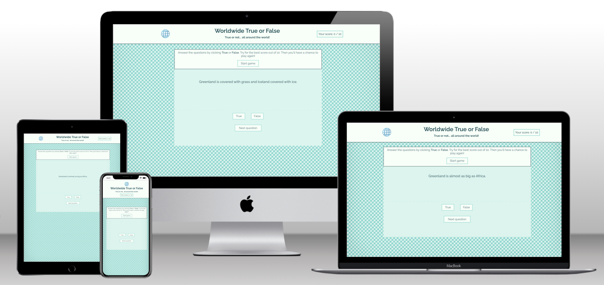

# 🌐 Worldwide True or False
A simple geography quiz to test your knowledge and learn new facts.

<!--  -->

## UX
### Website owner goals
The purpose of this website is to let users test their knowledge and learn new facts about geography. It has a simple interface that is fully responsive for different screen sizes, and it can be updated with new information as necessary.

### User goals
New user goals:
- User is able to test their knowledge about geography using a fun and simple true-or-false game.

Returning user goals:
- User is able to gain knowledge by practicing.

### User stories
<!-- As a job-seeking junior web developer:
- I would like to show potential employers my qualifications.
- I would like to show what’s special about me as a team member.
- I would like to be contacted by potential employers.

As a potential future employer:
- I would like to find out about a potential employee’s qualifications.
- I would like to have a sense of how they would fit into my team. -->

### Structure of the website
This is a one-page website designed to provide users with a fun game that’s easy to enjoy on all types of devices. The simplicity of the design, fun questions, and encouraging feedback give a satisfying user experience.

### Surface
Colors  
I developed a color palette using [Coolors](https://coolors.co/). This turquoise palette is inspired by the blue-green color of the earth, and coordinates with the game's logo, the "globe with meridians" emoji.
 

Fonts  
I used [Google Fonts](https://fonts.google.com/specimen/Raleway) and chose a sans serif font with an interesting uppercase "W" that makes a fun logo for the game.  

Images  
I used Emojipedia to find and download the logo image. The outline of a globe represents knowledge waiting to be discovered.  
  

## Features
The website has a header with a logo and score area. In the body of the website there is an area for questions, and buttons for the answer choices (True or False) and to show the next question.  
- Header: The header includes a fun logo and the title of the game.
 
- Score area: The score area is within the header. It is centered below the other content, and on larger screens where the header content is evenly spaced, it appears at the right side.
 
- Question area: The current question appears clearly in the center of the page.
 
- Button area: There are two buttons for answers: "True" and "False." Once the user clicks their choice, an alert shows whether it was right or wrong. There is also a button for "Next question," which loads the following question.
 
- Alerts: Pop-up alerts show the user whether their answer was correct or not. Once they close the alert window, the new score is incremented.

### Wireframes
I used Balsamiq to create wireframes for this game. This was very helpful for planning the structure and setring up the functionality.  

### Favicon
I used a [globe with meridians](https://favicon.io/emoji-favicons/globe-with-meridians) as a favicon, which is the same as the game's logo.  

### Future implementations

In the future this website can be updated with more questions and greater functionality. For instance:  
- Link the questions to Fetch API to provide more questions  
- Create a choice of special quiz topics
- Make the scoring system more sophisticated

### Technologies used:
HTML 5 as a structure language  
CSS as a style language  
JavaScript to add functionality
Google Fonts  
Balsamiq for wireframes  
GitHub  
Git  
Gitpod  

## Testing

### Functionality testing
The deployed website was tested throughout the building process using Chrome Devtools.

### Compatibility testing
The website was tested in Chrome and Safari, on the following devices:
 
iPhone 12 Mini  
Macbook Air

### User stories testing
<!-- As a job-seeking junior web developer:
- _I would like to show potential employers my qualifications._  
The About page shows my career path.
- _I would like to show what’s special about me as a team member._  
The website's branding is direct and bold yet friendly and approachable.
- _I would like to be contacted by potential employers._  
The Contact page has a simple and easy contact form, reachable from everywhere on the website.

As a potential future employer:
- _I would like to find out about a potential employee’s qualifications._  
The About page shows my career path including the date I will graduate from the Code Institute course.
- _I would like to have a sense of how they would fit into my team._  
The headings and the About page are intentionally informal and friendly, and my interpersonal skills are included. -->

## Issues found during development

### Performance testing
<!-- I used Chrome Developer Tools for troubleshooting functionality and style problems during development. After deploying, some issues were still unresolved. Trial and error, Googling - and patience! - were most helpful. This is how I learned the most.  
I used the Lighthouse tool to test performance in incognito mode, as suggested by my mentor. After making corrections to the meta description and the profile image size, these were the results on mobile:     
And on desktop:   -->

### Code validation
<!-- - HTML   I validated the HTML code with W3C and found 2 errors in the meta description. The typos were easily corrected. The finished version has no errors. -->

<!-- - CSS   I validated the CSS code with (Jigsaw) validator and found 1 error in the margin of the name styles in the header. I decided that this style wasn't working anyway, and deleted the line. The finished version has no errors. -->

## Deployment
This website was deployed on GitHub pages.  
The live link can be found [here](https://emilyrosenberg.github.io/worldwide-game/).

## Screenshots

### During development
<!-- I added intitial html and styles in a different color scheme, but after I found a meaningful background image, I updated the colors. This was the initial style:   
Initially, the footer was at the bottom of the content, as in the Love Running Project. I wanted it to be visible all the time, so that the user could always see the contact options. This was the previous design:   
The text was left-justified, and I was not happy with the way it looked on larger screens. My mentor suggested centering it. This was the original style:  -->

### Finished site
<!-- These are screenshots of the finished site:  
        -->

## Credits
<!-- - I used code from the Love Running Walkthrough Project extensively to outline this project. As the project progressed, I was able to replace much of that code with my own code. The structure and styling of several areas, including the navigation bar and the contact form, remain very close or identical to code from the walkthrough project. These are credited more specifically in the style sheet.  
- I was able to solve problems with help from Stack Overflow, FreeCodeCamp, and MakeUseOf.  
- I used [this readme](https://github.com/marcin-kli/MP1/blob/Milestone-Projects/README.md#annies-portfolio-website) by Annie O'Donahoe as a framework for writing my readme.
- I would like to thank my Code Institute mentor, Adegbenga Adeye, for reassurance, support, and extra resources.  
- Thanks to my Cohort Facilitator, David Calikes, for advice about how to create an MVP on the "fast track."  
- And I'm also thankful to my teachers at the Digital Career Institute who patiently guided me through the basics for the first time, earlier this year. -->