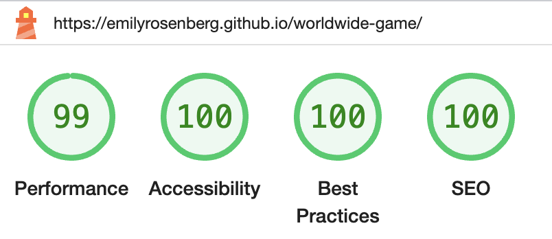

# 🌐 Worldwide True or False
A simple geography quiz to test your knowledge and learn new facts.

## UX
### Website owner goals
The purpose of this website is to let users test their knowledge and learn new facts about geography. It has a simple interface that is fully responsive for different screen sizes, and it can be updated with new information as necessary.

### User goals
New user goals:
- User is able to test their knowledge about geography using a fun and simple true-or-false game.

Returning user goals:
- User is able to gain knowledge by practicing.

### User stories
As a new user:
<!-- - I would like to xyz.   -->

As a returning user:
<!-- - I would like to xyz.   -->

### Structure of the website
This is a one-page website designed to provide users with a fun game that’s easy to enjoy on all types of devices. The simplicity of the design, fun questions, and encouraging feedback give a satisfying user experience.

### Surface
Colors  
I developed a color palette using [Coolors](https://coolors.co/). This turquoise palette is inspired by the blue-green color of the earth, and coordinates with the game's logo, the "globe with meridians" emoji.
 

 
For the background design, I used a [CSS pattern](https://www.magicpattern.design/tools/css-backgrounds) as suggested by my cohort facilitator, David Calikes.

Fonts  
I used [Google Fonts](https://fonts.google.com/specimen/Raleway) and chose a sans serif font with an interesting uppercase "W" that makes a fun logo for the game.  

Images  
I used Emojipedia to find and download the logo image. The outline of a globe represents knowledge waiting to be discovered.  
  

## Features
The website has a header with a logo and score area. In the body of the website there is an area for questions, and buttons for the answer choices (True or False) and to show the next question.  
- Header: The header includes a fun logo and the title of the game.
 
- Score area: The score area is within the header. It is centered below the other content, and on larger screens where the header content is evenly spaced, it appears at the right side.
 
- Question area: The current question appears clearly in the center of the page.
 
- Button area: There are two buttons for answers: "True" and "False." Once the user clicks their choice, an alert shows whether it was right or wrong. There is also a button for "Next question," which loads the following question.
 
- Responses: These show the user whether their answer was correct or not. I searched online for [tips](https://www.geeksforgeeks.org/how-to-stack-elements-in-css/), and layered elements with CSS to create this functionality.
- Play again: This reloads the page, restarting the game from the beginning. I found information about how to do this from [freeCodeCamp](https://www.freecodecamp.org/news/javascript-refresh-page-how-to-reload-a-page-in-js/#:~:text=Method%201%3A%20How%20to%20Refresh,and%20loading%20the%20latest%20content.).

### Wireframes
I used Balsamiq to create wireframes for this game. This was very helpful for planning the structure and functionality.  

### Favicon
I used the [globe with meridians emoji](https://favicon.io/emoji-favicons/globe-with-meridians) as a favicon, which is the same as the game's logo.  

### Future implementations
In the future this website can be updated with more questions and greater functionality. For instance:  
- Link the questions to Fetch API to provide more questions  
- Create a choice of special quiz topics
- Make the scoring system more sophisticated

### Technologies used:
HTML 5 as a structure language  
CSS as a style language  
JavaScript to add functionality
Google Fonts  
Balsamiq for wireframes  
GitHub  
Git  
Gitpod  

## Testing

### Functionality testing
The deployed website was tested throughout the building process using Chrome Devtools.

### Compatibility testing
The website was tested in Chrome and Safari, on the following devices:
 
iPhone 12 Mini  
Macbook Air

### User stories testing
As a new user:
<!-- - _I would like to xyz._  
The game... -->

As a returning user:
<!-- - _I would like to xyz._  
The game... -->

## Issues found during development

### Performance testing
I used Chrome Developer Tools for troubleshooting functionality and style problems during development. It was difficult to find the source of some issues on my own, and the Code Institute tutors helped the most. 
Chrome Developer tools was really useful for testing the responsivity of the website, especially since I developed a wider-screen version first, and then created the mobile version. Because I was able to see the dimensions of each element, and how the flex styles were working, I was able to figure it out.  
I used the Lighthouse tool to test performance in incognito mode, as suggested by my mentor. 
These were the results on mobile:  
And on desktop: 

### Code validation
- HTML   I validated the HTML code with W3C and found no errors.
- CSS   I validated the CSS code with (Jigsaw) validator and found no errors.
- JavaScript   I validated the Javascript code with JSHINT and found no warnings or errors.

## Deployment
This website was deployed on GitHub pages.  
The live link can be found [here](https://emilyrosenberg.github.io/worldwide-game/).

## Screenshots

### During development
I added intitial html and styles with placeholder background colors:   
With initial styles and hard-coded placeholder content, the website looked like this:
 

### Finished site
These are screenshots of the finished site:  

## Credits
- I used code from the Love Maths Walkthrough Project to outline this project, and code from the Love Running Walkthrough Project to style it.
- I also used suggestions from my Code Institute tutors, Roman and Martin, and code from Ricoshae's [tutorial](https://www.youtube.com/watch?v=MnkD82iHe30), which was suggested by my cohort facilitator, David Calikes.
- I used [this readme](https://github.com/marcin-kli/MP1/blob/Milestone-Projects/README.md#annies-portfolio-website) by Annie O'Donahoe as a framework for writing my readme.
- I would like to thank my Code Institute mentor, Adegbenga Adeye, for ideas, support, and extra resources.  
- Thanks to my cohort facilitator, David Calikes, for reassurance and reality-checks during this project.